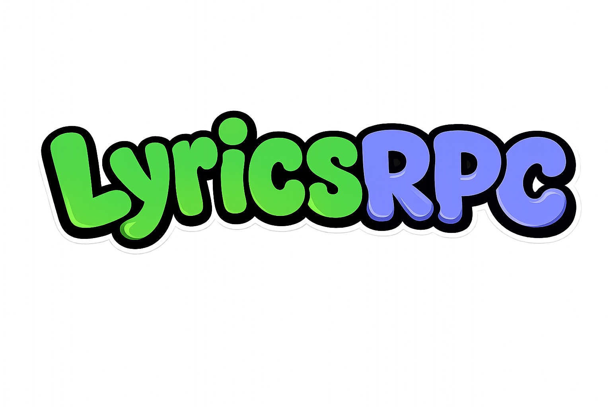

<p align="center">
  
</p>

---

# LyricsRPC

Lekka aplikacja Discord Rich Presence dla systemu Windows, synchronizująca teksty piosenek ze Spotify w czasie rzeczywistym na profilu Discord. Działa bezpośrednio przez Windows Media Session (SMTC) i Discord IPC — bez konieczności instalowania wtyczek, rozszerzeń czy modyfikowania klienta Spotify.

---

## Funkcje

- **Synchronizacja tekstu w czasie rzeczywistym** — Wyświetla na profilu Discord wers tekstu aktualnie odtwarzany w utworze.
- **Dedykowane okno aplikacji** — Działa jako niezależne okno aplikacji bez potrzeby otwierania przeglądarki.
- **Zasobnik systemowy (Tray)** — Działa w tle w zasobniku systemowym; minimalizuje się do traya i pozwala na szybkie przywracanie lub wyłączenie.
- **Okładka lub własna grafika** — Wyświetla oryginalną okładkę albumu lub niestandardowy obraz/GIF.
- **Pasek postępu i czas utworu** — Wyświetla dokładny czas trwania i postęp utworu na Discordzie.
- **Niskie zużycie zasobów** — Minimalne obciążenie procesora i pamięci RAM.

---

## Wymagania

- **Ponadprzeciętne IQ** (lub umiejętność czytania ze zrozumieniem)
- **Windows 10 / 11** (64-bit)
- **Spotify** (wersja desktopowa)
- **Discord** (wersja desktopowa)
- **Discord Application ID** (Client ID z [Discord Developer Portal](https://discord.com/developers/applications))

---

## Instalacja i Uruchomienie

### Gotowa paczka (Zalecane)

1. Pobierz i wypakuj **`LyricsRPC v0.2.1.zip`** z zakładki [Releases](../../releases).
2. Uruchom **`LyricsRPC.exe`**.
3. W oknie programu wklej swój **Application ID** z Discord Developer Portal:
   - Wejdź na [Discord Developer Portal](https://discord.com/developers/applications).
   - Kliknij **New Application**, podaj nazwę i zapisz.
   - W zakładce **General Information** skopiuj **Application ID**.
   - Wklej identyfikator w oknie programu i kliknij **Zapisz ustawienia**.
4. Włącz utwór na Spotify — tekst pojawi się na profilu Discord.

---

### Uruchomienie ze źródeł

Wymagane środowisko [Bun](https://bun.sh) (v1.1+):

```bash
# 1. Klonowanie repozytorium
git clone https://github.com/fallenb0x/lyricsRPC.git
cd lyricsRPC

# 2. Instalacja zależności
bun install

# 3. Uruchomienie
bun run src/index.ts
```

Kompilacja do plików wykonywalnych:
```bash
bun run compile-bun
csc.exe /target:winexe /optimize+ /win32icon:"static/logo.ico" /out:"build/LyricsTray.exe" /reference:System.Windows.Forms.dll /reference:System.Drawing.dll "src/TrayApp.cs"
```

---

## Konfiguracja

Ustawienia można zmieniać w oknie programu lub w pliku `settings.json`:

```json
{
  "port": 8999,
  "openBrowserOnStart": true,
  "minimizeToTray": true,
  "discord": {
    "clientId": "TWÓJ_APPLICATION_ID",
    "enabled": true,
    "showTimestamps": true,
    "showAlbumArt": true,
    "customLargeImage": "",
    "format": {
      "name": "{song_name} - {lyrics}",
      "details": "{song_name} - {song_author}",
      "state": "{lyrics}"
    }
  }
}
```

### Zmienne szablonu formatowania:
- `{song_name}` — Tytuł utworu
- `{song_author}` — Wykonawca utworu
- `{lyrics}` — Aktualny wers tekstu

---

## Odinstalowanie

Aplikacja jest w pełni przenośna (portable), nie tworzy wpisów w rejestrze i nie instaluje usług systemowych:

1. Kliknij prawym przyciskiem myszy ikonę programu w zasobniku systemowym (obok zegarka) i wybierz **Wyłącz**.
2. Usuń folder z programem.

---

## FAQ

**1. Status na Discordzie się nie wyświetla / wskaźnik pokazuje „Rozłączono”**
- Upewnij się, że desktopowa aplikacja Discord jest włączona i jesteś zalogowany.
- W ustawieniach Discorda przejdź do: **Ustawienia użytkownika** ➔ **Prywatność aktywności** ➔ włącz **„Wyświetlaj bieżącą aktywność jako status”**.
- Sprawdź, czy wprowadzony Application ID jest poprawny i kliknięto przycisk zapisu.

**2. Muzyka gra, ale brak tekstu piosenki**
- Teksty pobierane są automatycznie z baz LrcLib oraz NetEase Music. Jeżeli utwór nie posiada zsynchronizowanego tekstu w bazie, wyświetlany jest stan domyślny lub tytuł i autor.

**3. Jak zminimalizować, przywrócić lub zamknąć aplikację?**
- Zamknięcie lub zminimalizowanie okna chowa program do zasobnika systemowego (tray).
- Kliknięcie lewym przyciskiem myszy ikony w zasobniku przywraca okno.
- Kliknięcie prawym przyciskiem myszy na ikonę i wybranie **Wyłącz** całkowicie zamyka program.

**4. Co się dzieje przy ponownym uruchomieniu programu?**
- Aplikacja wykrywa już działający proces w tle, przywraca jego okno na pierwszy plan i zamyka duplikat.
