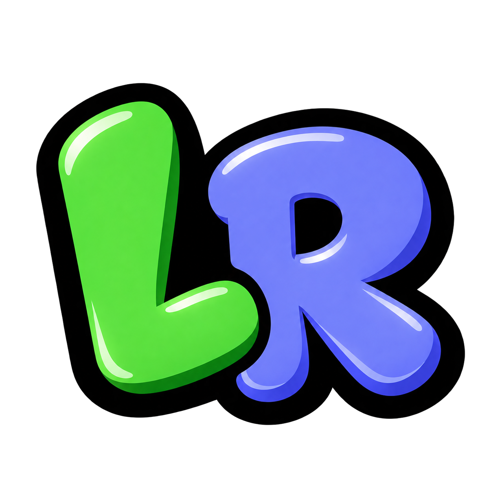

<p align="center">
  
</p>

<h1 align="center">LyricsRPC</h1>

<p align="center">
  Lekka aplikacja Discord Rich Presence dla systemu Windows, która w czasie rzeczywistym synchronizuje i wyświetla wersy tekstu piosenek ze Spotify na Twoim profilu Discord.
</p>

<p align="center">
  Działa w pełni autonomicznie przez <b>Windows Media Session (SMTC)</b> i <b>Discord IPC</b> — bez instalowania dodatków, modyfikacji Spotify czy Spicetify.
</p>

---

## ✨ Główne funkcje

- 🎵 **Synchronizacja tekstu w czasie rzeczywistym** — Wyświetla na profilu Discord dokładnie ten wers, który w danym ułamku sekundy leci na Spotify.
- 🪟 **Dedykowane okno aplikacji** — Działa jako niezależne okno aplikacji bez potrzeby otwierania przeglądarki.
- 📌 **Zasobnik systemowy (System Tray)** — Działa dyskretnie w tle. Kliknięcie ikony w zasobniku przywraca okno, a menu pod prawym przyciskiem myszy umożliwia szybkie wyłączenie aplikacji.
- 🎨 **Własna grafika lub okładka albumu** — Automatycznie pobiera okładkę odtwarzanego albumu lub pozwala ustawić własny obraz/GIF.
- ⏱️ **Pasek postępu i czas utworu** — Pokazuje upływający czas utworu bezpośrednio w profilu Discord.
- ⚡ **Minimalne zużycie zasobów** — Lekki proces natywny, zoptymalizowany pod kątem zerowego wpływu na wydajność gier i systemu.

---

## 📋 Wymagania

- **System operacyjny:** Windows 10 lub Windows 11 (64-bit)
- **Spotify:** Oficjalna aplikacja desktopowa Spotify
- **Discord:** Oficjalna aplikacja desktopowa Discord
- **Discord Application ID:** Własny identyfikator aplikacji z [Discord Developer Portal](https://discord.com/developers/applications)

---

## 🚀 Instalacja i Uruchomienie

### Szybki start (Zalecane)

1. Pobierz archiwum **`LyricsRPC v0.2.1.zip`** z zakładki [Releases](../../releases).
2. Wypakuj całą zawartość do wybranego folderu (np. `C:\Program Files\LyricsRPC` lub dowolnego innego katalogu).
3. Uruchom **`LyricsRPC.exe`**.
4. W oknie aplikacji wklej swój **Discord Application ID** (Client ID):
   - Wejdź na [Discord Developer Portal](https://discord.com/developers/applications).
   - Kliknij **New Application**, wpisz nazwę (np. `Spotify` lub `Lyrics`) i zapisz.
   - W zakładce **General Information** skopiuj **Application ID**.
   - Wklej identyfikator w oknie LyricsRPC i kliknij **Zapisz ustawienia**.
5. Włącz muzykę w Spotify — tekst zacznie natychmiast pojawiać się na Twoim profilu Discord!

---

### Uruchomienie ze źródeł (Dla programistów)

Wymagane środowisko [Bun](https://bun.sh) (v1.1+) na systemie Windows.

```bash
# 1. Klonowanie repozytorium
git clone https://github.com/fallenb0x/lyricsRPC.git
cd lyricsRPC

# 2. Instalacja zależności
bun install

# 3. Uruchomienie w trybie developerskim
bun run src/index.ts
```

Aby skompilować pliki wykonywalne:
```bash
# Kompilacja głównego pliku wykonywalnego
bun run compile-bun

# Kompilacja pomocnika zasobnika systemowego
csc.exe /target:winexe /optimize+ /win32icon:"static/logo.ico" /out:"build/LyricsTray.exe" /reference:System.Windows.Forms.dll /reference:System.Drawing.dll "src/TrayApp.cs"
```

---

## ⚙️ Konfiguracja i Ustawienia

Ustawienia można zmieniać bezpośrednio w oknie programu lub edytując plik `settings.json`:

```json
{
  "port": 8999,
  "openBrowserOnStart": true,
  "minimizeToTray": true,
  "discord": {
    "clientId": "TWÓJ_APPLICATION_ID",
    "enabled": true,
    "showTimestamps": true,
    "showAlbumArt": true,
    "customLargeImage": "",
    "format": {
      "name": "{song_name} - {lyrics}",
      "details": "{song_name} - {song_author}",
      "state": "{lyrics}"
    }
  }
}
```

### Zmienne w szablonach formatowania:
- `{song_name}` — Tytuł aktualnego utworu
- `{song_author}` — Wykonawca utworu
- `{lyrics}` — Aktualnie odtwarzany wers tekstu

---

## 🗑️ Odinstalowanie

Aplikacja jest w pełni przenośna (portable) i nie modyfikuje rejestru systemu ani nie instaluje usług:

1. Kliknij prawym przyciskiem myszy na ikonę **LyricsRPC** w zasobniku systemowym (obok zegara Windows) i wybierz **Wyłącz**.
2. Usuń folder z wypakowaną aplikacją.
3. To wszystko — program został całkowicie usunięty.

---

## ❓ FAQ (Często zadawane pytania)

#### 1. Status na Discordzie się nie wyświetla / wskaźnik pokazuje „Rozłączono”
- Upewnij się, że desktopowa aplikacja Discord jest uruchomiona i jesteś w niej zalogowany.
- Sprawdź w Discordzie: **Ustawienia użytkownika** ➔ **Prywatność aktywności** ➔ włącz opcję **„Wyświetlaj bieżącą aktywność jako status”**.
- Upewnij się, że wklejony **Application ID** z Discord Developer Portal jest poprawny i kliknięto **Zapisz ustawienia**.

#### 2. Muzyka gra, ale tekst nie jest wyświetlany
- Teksty pobierane są automatycznie z serwisów LrcLib oraz NetEase Music. Jeśli dany utwór nie posiada zsynchronizowanego tekstu w bazach, aplikacja wyświetli status domyślny lub tytuł i wykonawcę.
- Upewnij się, że Spotify odtwarza utwór lokalnie na tym samym komputerze.

#### 3. Jak schować lub ponownie otworzyć okno programu?
- Zamknięcie lub zminimalizowanie okna pozwala programowi dalej działać w tle.
- Aby przywrócić okno, kliknij lewym przyciskiem myszy na ikonę **LR** w zasobniku systemowym (obok zegarka na pasku zadań) lub kliknij prawym przyciskiem myszy i wybierz **Otwórz LyricsRPC**.

#### 4. Jak całkowicie zamknąć aplikację?
- Kliknij prawym przyciskiem myszy na ikonę w zasobniku systemowym i kliknij **Wyłącz**.

#### 5. Co się stanie, gdy uruchomię aplikację po raz drugi?
- Aplikacja automatycznie wykryje działającą instancję w tle, otworzy jej okno i natychmiast zamknie zbędny proces duplikatu.
